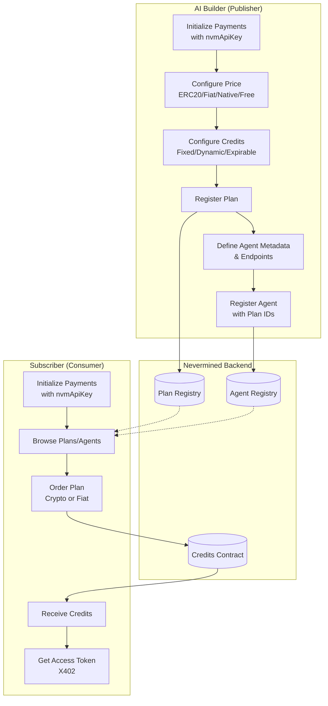
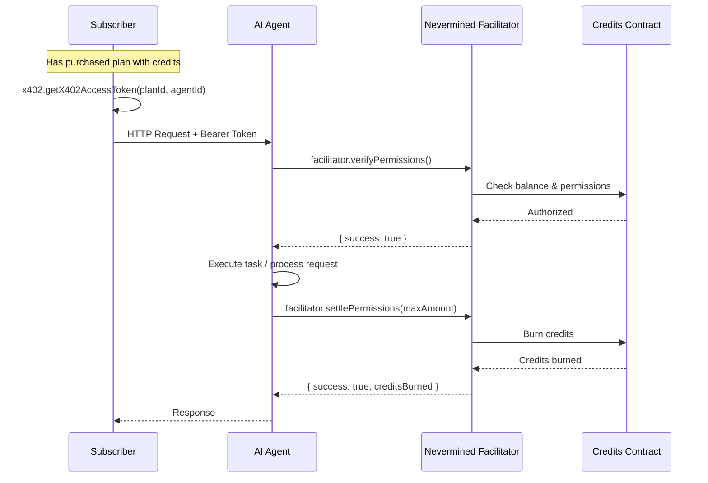
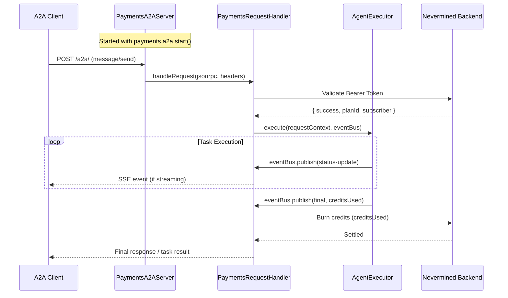
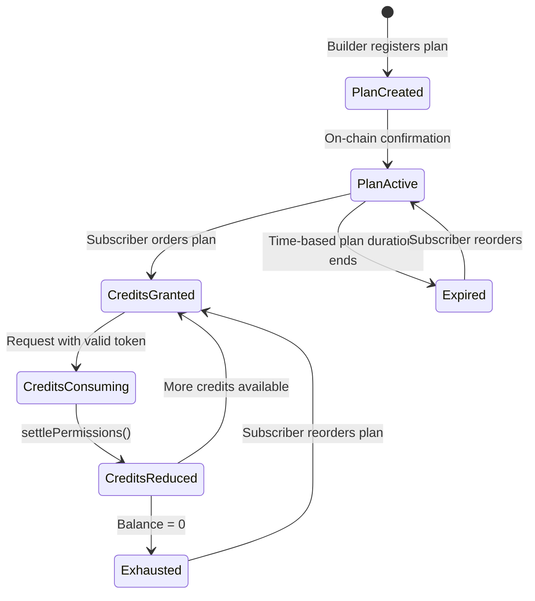

# Architecture

This document describes the architecture of the Nevermined Payments TypeScript SDK.

## Overview

The SDK enables AI builders to monetize their agents and services through a credit-based payment system. It provides integrations for multiple protocols (HTTP/REST, MCP, A2A) and handles the complete lifecycle from plan registration to credit consumption.

## Core Components

```
src/
├── payments.ts          # Main Payments class - entry point
├── environments.ts      # Environment configurations (sandbox, live, etc.)
├── plans.ts             # Plan configuration helpers
├── index.ts             # Public exports
│
├── api/                 # Backend API integrations
│   ├── base-payments.ts # Base class with HTTP utilities
│   ├── plans-api.ts     # Plan registration and management
│   ├── agents-api.ts    # Agent registration and management
│   ├── requests-api.ts  # Request validation and tracking
│   ├── contracts-api.ts # On-chain contract interactions
│   ├── nvm-api.ts       # API URL constants
│   └── observability-api/  # Helicone integration
│
├── mcp/                 # Model Context Protocol integration
│   ├── core/            # Paywall, auth, credits context
│   ├── http/            # OAuth router, managed server
│   ├── types/           # MCP-specific types
│   └── utils/           # Helpers for logical URLs, errors
│
├── a2a/                 # Agent-to-Agent protocol integration
│   ├── server.ts        # A2A server with payments
│   ├── agent-card.ts    # Payment-enabled agent cards
│   ├── clientRegistry.ts # Client management
│   └── paymentsRequestHandler.ts  # Request handling
│
├── x402/                # X402 payment protocol
│   ├── token.ts         # Access token generation
│   └── facilitator-api.ts  # Verify/settle permissions
│
└── common/              # Shared types and utilities
    ├── types.ts         # Core type definitions
    └── payments.error.ts # Error handling
```

## Payment Plan Types

| Type | Access Limit | Expiration | Use Case |
|------|--------------|------------|----------|
| Credits Plan | Fixed or Dynamic | Never expires | Pay-per-use APIs with predictable or variable costs |
| Time Plan | Unlimited requests | Duration-based | Subscription access for a period |
| Trial Plan | Credits or Time | Single purchase only | Free trials for new users |
| Pay-As-You-Go | Dynamic per-request | Per-request billing | Variable pricing based on usage |

**Credits configuration options:**
- **Fixed**: Same credits burned per request (e.g., 1 credit per call)
- **Dynamic**: Variable credits per request within min/max bounds (e.g., 1-10 credits based on compute)

## Agent and Plan Lifecycle



## Request Flow with Credit Burning



## MCP Integration Flow

```mermaid
flowchart TB
    subgraph Setup["Server Setup"]
        M1[Initialize Payments<br/>with nvmApiKey]
        M2[registerTool/Resource/Prompt<br/>with credits option]
        M3[payments.mcp.start<br/>port, agentId, serverName]
    end

    subgraph OAuth["OAuth 2.1 Endpoints Auto-configured"]
        O1[/.well-known/oauth-protected-resource]
        O2[/.well-known/oauth-authorization-server]
        O3[/.well-known/openid-configuration]
        O4[/register - Client Registration]
    end

    subgraph Request["Tool/Resource Request"]
        R1[Client sends JSON-RPC<br/>with Bearer token]
        R2[Paywall validates token]
        R3[Handler executes]
        R4[Credits burned automatically]
        R5[Response returned]
    end

    M1 --> M2
    M2 --> M3
    M3 --> OAuth

    R1 --> R2
    R2 -->|Valid| R3
    R2 -->|Invalid| R6[402 Payment Required]
    R3 --> R4
    R4 --> R5
```

## A2A Integration Flow



## Key Integration Patterns

### 1. Basic HTTP Agent

```typescript
// Builder: Register agent
const { planId } = await payments.plans.registerCreditsPlan(metadata, priceConfig, creditsConfig)
const { agentId } = await payments.agents.registerAgent(agentMetadata, api, [planId])

// Subscriber: Access agent
const { accessToken } = await payments.x402.getX402AccessToken(planId, agentId)
fetch(agentUrl, { headers: { Authorization: `Bearer ${accessToken}` } })

// Agent: Verify and settle
const result = await payments.facilitator.verifyPermissions({ planId, x402AccessToken, ... })
// ... do work ...
await payments.facilitator.settlePermissions({ planId, maxAmount, x402AccessToken, ... })
```

### 2. Registering and Authenticating MCP Server

```typescript
payments.mcp.registerTool('weather', config, handler, { credits: 5n })
payments.mcp.registerResource('weather', 'weather://custom-uri', config, handler, { credits: creditsHandler })
payments.mcp.registerPrompt('weather', config, handler, { credits: creditsHandler })

const { info, stop } = await payments.mcp.start({
  port: 5001,
  agentId,
  serverName: 'my-server'
})
```

### 3. A2A Server with Payments

```typescript
const agentCard = buildPaymentAgentCard(baseCard, { agentId, planId, credits: 10 })

const { stop } = payments.a2a.start({
  agentCard,
  executor: myExecutor,  // implements execute(ctx, eventBus)
  port: 6000
})
```

## Credit Flow States



## Environment Configuration

| Environment | Use Case | Frontend | Backend |
|-------------|----------|----------|---------|
| `sandbox` | Development/Testing | nevermined.app | api.sandbox.nevermined.app |
| `live` | Production | nevermined.app | api.live.nevermined.app |
| `custom` | Local development | Configurable via env vars |

## Error Handling

The SDK uses `PaymentsError` for all error conditions:

- **Plan/Agent not found**: Invalid IDs or not yet synced
- **Insufficient balance**: Credits exhausted
- **Invalid token**: Expired or malformed access token
- **Unauthorized**: Token doesn't have access to the requested resource
- **Payment required (402)**: Request rejected due to payment issues
