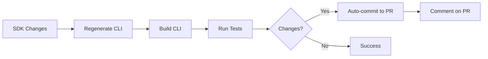
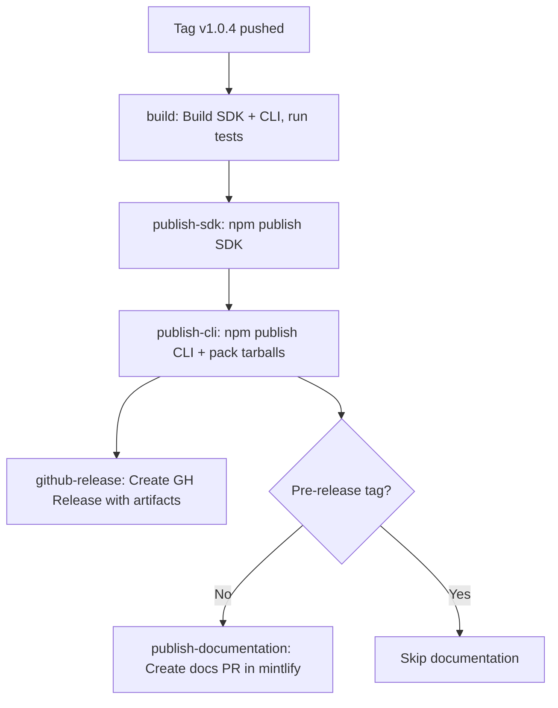

# GitHub Actions Automation Setup

## Overview

Automated CI/CD for Nevermined Payments SDK and CLI with three main workflows:

1. **CLI Auto-Sync** - Keeps CLI in sync with SDK changes on every push/PR
2. **Consolidated Release** - Single workflow that publishes SDK, CLI, creates GitHub Release, and updates documentation on version tags
3. **Finalize Release** - Creates version tags from merged release PRs

---

## 1. CLI Auto-Sync Workflow

**File:** `.github/workflows/cli-sync-and-test.yml`

### Trigger

- Push or Pull Request to `main`/`develop`
- Only when SDK code changes: `src/**`, `package.json`, `tsconfig.json`

### What It Does



### Process

1. Detects SDK changes
2. Installs dependencies (SDK + CLI)
3. Builds SDK
4. Regenerates CLI commands: `yarn generate`
5. Builds CLI: `yarn build:manifest`
6. Runs unit tests: `yarn test:unit`
7. Runs integration tests: `yarn test:integration`
8. Commits CLI updates to same branch/PR
9. Adds PR comment

---

## 2. Consolidated Release Workflow

**File:** `.github/workflows/release.yml`

### Trigger

- New version tag: `v1.0.4`, `v2.1.0`, `v1.0.6-rc0`, etc.

### What It Does



### Job 1: Build & Test (`build`)

- Installs SDK and CLI dependencies
- Builds SDK and CLI
- Runs CLI unit and integration tests
- Acts as a gate for subsequent publish jobs

### Job 2: Publish SDK (`publish-sdk`)

- Publishes `@nevermined-io/payments` to npm
- Packs and uploads SDK tarball as artifact

### Job 3: Publish CLI (`publish-cli`)

- Updates CLI version to match tag
- Publishes `@nevermined-io/cli` to npm
- Packs standalone tarballs
- Uploads CLI tarballs as artifact
- Commits CLI version bump to main

### Job 4: GitHub Release (`github-release`)

- Downloads SDK tarball and CLI tarballs artifacts
- Extracts changelog if available
- Creates GitHub Release with all artifacts attached

### Job 5: Publish Documentation (`publish-documentation`)

- **Skipped for pre-release tags** (`-rc`, `-alpha`, `-beta`)
- Checks out `nevermined-io/docs_mintlify`
- Updates SDK docs in `docs/api-reference/typescript/`
- Updates CLI docs in `docs/api-reference/cli/`
- Adds version metadata to all files
- Creates PR with auto-merge enabled

---

## 3. Finalize Release Workflow

**File:** `.github/workflows/finalize-release.yml`

### Trigger

- PR merged from `release/*` branch into `main`

### What It Does

1. Reads version from `package.json`
2. Creates and pushes `v*.*.*` tag
3. Tag push triggers `release.yml` for the full release pipeline

---

## Version Strategy

### Synchronized Versioning

```
SDK Tag:    v1.0.4
├── SDK:    @nevermined-io/payments@1.0.4
└── CLI:    @nevermined-io/cli@1.0.4  (auto-updated)
```

**Key Points:**

- Single source of truth: Git tags
- CLI version auto-matches SDK version
- No independent CLI versioning
- Consistent releases across packages

---

## Required Setup

### GitHub Secrets

Add these secrets in repository settings:

| Secret             | Description                    | How to Get                                                                                                                                                                                              |
| ------------------ | ------------------------------ | ------------------------------------------------------------------------------------------------------------------------------------------------------------------------------------------------------- |
| `NPM_TOKEN`        | npm automation token           | [npmjs.com](https://npmjs.com) -> Account -> Access Tokens -> Generate (Automation)                                                                                                                      |
| `API_TOKEN_GITHUB` | Fine-grained PAT for docs repo | [github.com/settings/tokens](https://github.com/settings/personal-access-tokens/new) -> Repository access -> nevermined-io/docs_mintlify -> Permissions: Contents (Read/Write), Pull Requests (Read/Write) |

**Optional (for testing workflows):**
| Secret | Description |
|--------|-------------|
| `TEST_SUBSCRIBER_API_KEY` | Test subscriber API key |
| `TEST_BUILDER_API_KEY` | Test builder API key |
| `TEST_ENVIRONMENT` | Test environment (e.g., `sandbox`) |

### NPM Token Setup

```bash
# Login to npm
npm login

# Generate automation token
npm token create --type=automation

# Add to GitHub Secrets:
# Settings -> Secrets -> Actions -> New repository secret
# Name: NPM_TOKEN
# Value: <paste token>
```

### GitHub Token Setup

```bash
# Create fine-grained PAT at:
# https://github.com/settings/personal-access-tokens/new

# Settings:
Name: Nevermined Docs Automation
Expiration: 1 year (or custom)
Repository access: Only select repositories
  -> nevermined-io/docs_mintlify
Permissions:
  -> Contents: Read and write
  -> Pull requests: Read and write

# Add to GitHub Secrets:
# Settings -> Secrets -> Actions -> New repository secret
# Name: API_TOKEN_GITHUB
# Value: <paste token>
```

---

## Usage

### Normal Development Workflow

**Developer makes SDK changes:**

```bash
# 1. Make changes to SDK
vim src/api/plans-api.ts

# 2. Commit and push to PR
git add src/api/plans-api.ts
git commit -m "feat(api): add new plan method"
git push origin feature/new-plan-method

# 3. cli-sync-and-test.yml automatically:
#    - Regenerates CLI commands
#    - Runs tests
#    - Commits CLI updates to your PR
#    - Adds comment

# 4. Review auto-generated CLI changes
# 5. Merge PR as normal
```

### Creating a Release

**Maintainer creates new version:**

```bash
# 1. Ensure main branch is up to date
git checkout main
git pull

# 2. Update version in package.json
vim package.json
# Change: "version": "1.0.4"

# 3. Update CHANGELOG.md
vim CHANGELOG.md

# 4. Commit version bump
git add package.json CHANGELOG.md
git commit -m "chore: bump version to 1.0.4"
git push

# 5. Create and push tag
git tag v1.0.4 -m "Release v1.0.4"
git push --tags

# 6. release.yml automatically:
#    - Builds and tests SDK + CLI
#    - Publishes SDK to npm
#    - Publishes CLI to npm (with matching version)
#    - Creates GitHub Release with artifacts
#    - Creates docs PR in mintlify (stable releases only)

# 7. Monitor workflow progress
#    GitHub -> Actions tab -> "Release" workflow

# 8. Verify published packages
npm view @nevermined-io/payments@1.0.4
npm view @nevermined-io/cli@1.0.4
```

---

## Workflow Behavior

### On SDK Changes (Push/PR)

**Scenario 1: API Changes**

```
Developer changes: src/api/plans-api.ts
-> cli-sync-and-test.yml runs
-> CLI regenerated with new commands
-> Tests pass
-> Auto-commit to PR
```

**Scenario 2: Non-API Changes**

```
Developer changes: README.md
-> Workflow skipped (no src/ changes)
```

### On Version Tag

**Scenario 1: Stable Release (v1.0.4)**

```
Tag created: v1.0.4
-> release.yml runs sequentially:
   1. Build & test pass
   2. SDK published to npm
   3. CLI published to npm
   4. GitHub Release created with tarballs
   5. Documentation PR created in mintlify
```

**Scenario 2: Pre-release (v1.0.5-rc0)**

```
Tag created: v1.0.5-rc0
-> release.yml runs sequentially:
   1. Build & test pass
   2. SDK published to npm
   3. CLI published to npm
   4. GitHub Release created (marked as pre-release)
   5. Documentation skipped (pre-release tag)
```

**Scenario 3: Failed Tests**

```
Tag created: v1.0.4
-> Build & test fail
-> All publish jobs blocked
-> No release created
-> Fix required
```

---

## Troubleshooting

### CLI Not Auto-Updating

**Problem:** Changes to SDK but CLI not updated

**Check:**

1. Did the push modify `src/**`?
2. Is the branch `main` or `develop`?
3. Check workflow run in Actions tab
4. Look for errors in "Generate CLI commands" step

**Fix:**

```bash
# Manually trigger sync
cd cli
yarn generate
yarn build:manifest
yarn test:unit
git add .
git commit -m "chore(cli): manual sync"
```

### npm Publish Failed

**Problem:** Workflow fails at npm publish step

**Check:**

1. Is `NPM_TOKEN` secret set correctly?
2. Does version already exist? `npm view @nevermined-io/cli versions`
3. Is npm registry accessible?

**Fix:**

```bash
# Check package doesn't exist
npm view @nevermined-io/cli@1.0.4
# If exists: Need to bump version

# Re-run workflow with new version
git tag -d v1.0.4
git push --delete origin v1.0.4
# Bump version and recreate tag
```

### Docs PR Not Created

**Problem:** Documentation PR not appearing in docs_mintlify

**Check:**

1. Is the tag a stable release (not `-rc`, `-alpha`, `-beta`)?
2. Is `API_TOKEN_GITHUB` valid and not expired?
3. Does token have correct permissions?
4. Check workflow logs in "Create documentation PR" step

---

## Maintenance

### Updating Workflows

**When to update:**

- Adding new SDK API surfaces
- Changing CLI structure
- Modifying documentation layout
- Adding new test suites

**How to update:**

```bash
# 1. Edit workflow file
vim .github/workflows/release.yml

# 2. Test changes on a feature branch first
git checkout -b test/update-workflow
git push origin test/update-workflow

# 3. Monitor workflow run
# 4. Merge to main when verified
```

### Monitoring

**Check workflow status:**

```bash
gh run list --workflow=release.yml
gh run list --workflow=testing.yml
gh run list --workflow=cli-sync-and-test.yml
```

---

**Created:** 2026-02-01
**Updated:** 2026-02-10
**Version:** 2.0
