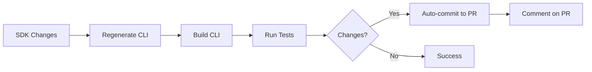
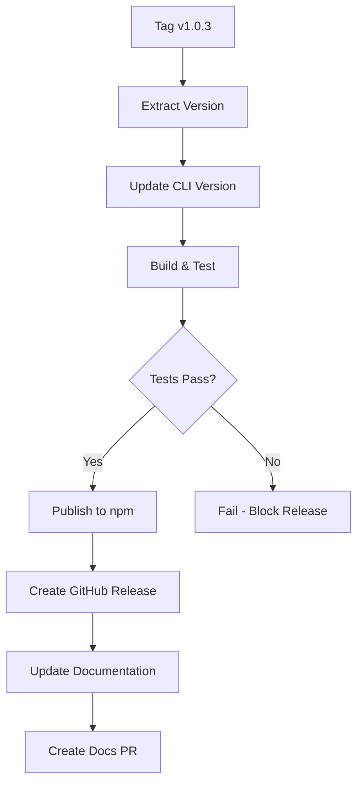

# GitHub Actions Automation Setup

## Overview

Automated CI/CD for Nevermined Payments SDK and CLI with two main workflows:

1. **CLI Auto-Sync** - Keeps CLI in sync with SDK changes on every push/PR
2. **CLI Publishing** - Publishes CLI to npm and updates documentation on version tags

---

## 1. CLI Auto-Sync Workflow

**File:** `.github/workflows/cli-sync-and-test.yml`

### Trigger

- Push or Pull Request to `main`/`develop`
- Only when SDK code changes: `src/**`, `package.json`, `tsconfig.json`

### What It Does



### Process

1. ✅ Detects SDK changes
2. ✅ Installs dependencies (SDK + CLI)
3. ✅ Builds SDK
4. ✅ Regenerates CLI commands: `yarn generate`
5. ✅ Builds CLI: `yarn build:manifest`
6. ✅ Runs unit tests: `yarn test:unit`
7. ✅ Runs integration tests: `yarn test:integration`
8. ✅ Commits CLI updates to same branch/PR
9. ✅ Adds PR comment

### Auto-Commit Example

```
chore(cli): auto-sync CLI with SDK changes

Co-Authored-By: GitHub Actions <github-actions[bot]@users.noreply.github.com>
```

### Benefits

- 🎯 Zero manual CLI synchronization
- 🎯 CLI always in sync with SDK
- 🎯 Tests run automatically
- 🎯 PR workflow unchanged
- 🎯 Blocks merge if tests fail

---

## 2. CLI Publishing Workflow

**File:** `.github/workflows/cli-publish.yml`

### Trigger

- New version tag: `v1.0.3`, `v2.1.0`, etc.
- Manual dispatch via GitHub UI

### What It Does



### Job 1: Publish CLI (`publish-cli`)

**Steps:**

1. ✅ Extracts version from tag (`v1.0.3` → `1.0.3`)
2. ✅ Updates `cli/package.json` version
3. ✅ Regenerates CLI commands
4. ✅ Builds CLI
5. ✅ Runs full test suite
6. ✅ Publishes to npm: `@nevermined-io/cli@1.0.3`
7. ✅ Packs tarballs for standalone distribution
8. ✅ Creates GitHub Release with binaries

**npm Package:**

```bash
npm install -g @nevermined-io/cli@1.0.3
```

### Job 2: Update Documentation (`update-documentation`)

**Steps:**

1. ✅ Checks out `nevermined-io/docs_mintlify`
2. ✅ Updates CLI docs → `docs/products/cli/`
3. ✅ Updates SDK docs → `docs/api-reference/typescript/`
4. ✅ Adds version metadata to all files
5. ✅ Creates PR in docs repository

**Documentation Structure:**

```
nevermined-io/docs_mintlify/
├── docs/
│   ├── products/
│   │   └── cli/              ← CLI Documentation (NEW)
│   │       ├── index.md      (from cli/README.md)
│   │       ├── 01-getting-started.md
│   │       ├── 02-plans.md
│   │       └── ...
│   └── api-reference/
│       └── typescript/        ← SDK Documentation (existing)
│           ├── installation.md
│           ├── payment-plans.md
│           └── ...
```

**Version Metadata Added:**

```yaml
---
version: 1.0.3
lastUpdated: 2026-02-01
---
```

---

## Version Strategy

### Synchronized Versioning

```
SDK Tag:    v1.0.3
├── SDK:    @nevermined-io/payments@1.0.3
└── CLI:    @nevermined-io/cli@1.0.3  (auto-updated)
```

**Key Points:**

- ✅ Single source of truth: Git tags
- ✅ CLI version auto-matches SDK version
- ✅ No independent CLI versioning
- ✅ Consistent releases across packages

---

## Required Setup

### GitHub Secrets

Add these secrets in repository settings:

| Secret             | Description                    | How to Get                                                                                                                                                                                              |
| ------------------ | ------------------------------ | ------------------------------------------------------------------------------------------------------------------------------------------------------------------------------------------------------- |
| `NPM_TOKEN`        | npm automation token           | [npmjs.com](https://npmjs.com) → Account → Access Tokens → Generate (Automation)                                                                                                                        |
| `API_TOKEN_GITHUB` | Fine-grained PAT for docs repo | [github.com/settings/tokens](https://github.com/settings/personal-access-tokens/new) → Repository access → nevermined-io/docs_mintlify → Permissions: Contents (Read/Write), Pull Requests (Read/Write) |

**Optional (for testing workflows):**
| Secret | Description |
|--------|-------------|
| `TEST_SUBSCRIBER_API_KEY` | Test subscriber API key |
| `TEST_BUILDER_API_KEY` | Test builder API key |
| `TEST_ENVIRONMENT` | Test environment (e.g., `staging_sandbox`) |

### NPM Token Setup

```bash
# Login to npm
npm login

# Generate automation token
npm token create --type=automation

# Add to GitHub Secrets:
# Settings → Secrets → Actions → New repository secret
# Name: NPM_TOKEN
# Value: <paste token>
```

### GitHub Token Setup

```bash
# Create fine-grained PAT at:
# https://github.com/settings/personal-access-tokens/new

# Settings:
Name: Nevermined Docs Automation
Expiration: 1 year (or custom)
Repository access: Only select repositories
  → nevermined-io/docs_mintlify
Permissions:
  → Contents: Read and write
  → Pull requests: Read and write

# Add to GitHub Secrets:
# Settings → Secrets → Actions → New repository secret
# Name: API_TOKEN_GITHUB
# Value: <paste token>
```

---

## Usage

### Normal Development Workflow

**Developer makes SDK changes:**

```bash
# 1. Make changes to SDK
vim src/api/plans-api.ts

# 2. Commit and push to PR
git add src/api/plans-api.ts
git commit -m "feat(api): add new plan method"
git push origin feature/new-plan-method

# 3. Workflow automatically:
#    - Regenerates CLI commands
#    - Runs tests
#    - Commits CLI updates to your PR
#    - Adds comment

# 4. Review auto-generated CLI changes
#    - Check the new commit on your PR
#    - Verify CLI tests passed

# 5. Merge PR as normal
```

### Creating a Release

**Maintainer creates new version:**

```bash
# 1. Ensure main branch is up to date
git checkout main
git pull

# 2. Update version in package.json
vim package.json
# Change: "version": "1.0.3"

# 3. Update CHANGELOG.md
vim CHANGELOG.md

# 4. Commit version bump
git add package.json CHANGELOG.md
git commit -m "chore: bump version to 1.0.3"
git push

# 5. Create and push tag
git tag v1.0.3 -m "Release v1.0.3"
git push --tags

# 6. Workflows automatically:
#    - Publish SDK to npm
#    - Publish CLI to npm (with matching version)
#    - Create GitHub Release
#    - Update documentation
#    - Create docs PR

# 7. Monitor workflow progress
#    - GitHub → Actions tab
#    - Wait for green checkmarks

# 8. Verify published packages
npm view @nevermined-io/payments@1.0.3
npm view @nevermined-io/cli@1.0.3

# 9. Review and merge docs PR
#    - Go to nevermined-io/docs_mintlify
#    - Review PR with docs updates
#    - Merge to publish
```

### Manual CLI Publish (if needed)

**Via GitHub UI:**

```
1. Go to Actions tab
2. Select "Publish CLI Package"
3. Click "Run workflow"
4. Enter version (e.g., 1.0.3)
5. Click "Run workflow"
```

---

## Workflow Behavior

### On SDK Changes (Push/PR)

**Scenario 1: API Changes**

```
Developer changes: src/api/plans-api.ts
→ Workflow runs
→ CLI regenerated with new commands
→ Tests pass
→ Auto-commit to PR ✅
```

**Scenario 2: Non-API Changes**

```
Developer changes: README.md
→ Workflow skipped (no src/ changes) ⏭️
```

**Scenario 3: CLI Already Synced**

```
Developer changes: src/api/plans-api.ts
→ Workflow runs
→ CLI already up to date
→ No commit needed ✅
```

### On Version Tag

**Scenario 1: Successful Release**

```
Tag created: v1.0.3
→ Both workflows run in parallel
→ Tests pass
→ npm publish successful
→ GitHub Release created
→ Docs PR created ✅
```

**Scenario 2: Failed Tests**

```
Tag created: v1.0.3
→ Tests fail
→ npm publish blocked 🚫
→ No release created
→ No docs updated
→ Fix required
```

---

## Troubleshooting

### CLI Not Auto-Updating

**Problem:** Changes to SDK but CLI not updated

**Check:**

1. Did the push modify `src/**`?
2. Is the branch `main` or `develop`?
3. Check workflow run in Actions tab
4. Look for errors in "Generate CLI commands" step

**Fix:**

```bash
# Manually trigger sync
cd cli
yarn generate
yarn build:manifest
yarn test:unit
git add .
git commit -m "chore(cli): manual sync"
```

### npm Publish Failed

**Problem:** Workflow fails at npm publish step

**Check:**

1. Is `NPM_TOKEN` secret set correctly?
2. Does version already exist? `npm view @nevermined-io/cli versions`
3. Is npm registry accessible?

**Fix:**

```bash
# Check package doesn't exist
npm view @nevermined-io/cli@1.0.3
# If exists: Need to bump version

# Re-run workflow with new version
git tag -d v1.0.3
git push --delete origin v1.0.3
# Bump version and recreate tag
```

### Docs PR Not Created

**Problem:** Documentation PR not appearing in docs_mintlify

**Check:**

1. Is `API_TOKEN_GITHUB` valid and not expired?
2. Does token have correct permissions?
3. Check workflow logs in "Create documentation PR" step

**Fix:**

```bash
# Regenerate GitHub token
# Update secret in repository settings
# Re-run workflow manually
```

---

## Testing Before Production

### Test CLI Sync Locally

```bash
# 1. Make SDK change
echo "// test" >> src/api/plans-api.ts

# 2. Regenerate CLI
cd cli
yarn generate

# 3. Check for changes
git status cli/

# 4. Run tests
yarn build:manifest
yarn test:unit
yarn test:integration

# 5. Revert test change
git checkout -- ../src/api/plans-api.ts cli/
```

### Test CLI Publishing (Dry Run)

```bash
# Build without publishing
cd cli
npm version 1.0.3 --no-git-tag-version
yarn build:manifest
npx oclif pack tarballs --no-xz

# Check output
ls -lh dist/

# Revert changes
git checkout package.json
rm -rf dist/
```

---

## Maintenance

### Updating Workflows

**When to update:**

- Adding new SDK API surfaces
- Changing CLI structure
- Modifying documentation layout
- Adding new test suites

**How to update:**

```bash
# 1. Edit workflow file
vim .github/workflows/cli-publish.yml

# 2. Test changes on a feature branch first
git checkout -b test/update-workflow
git push origin test/update-workflow

# 3. Monitor workflow run
# 4. Merge to main when verified
```

### Monitoring

**Check workflow status:**

- GitHub → Actions tab
- Filter by workflow name
- Review recent runs
- Check logs for errors

**Set up notifications:**

- GitHub → Settings → Notifications
- Enable "Actions" notifications
- Configure email/Slack alerts

---

## Benefits Summary

### For Developers

- ✅ No manual CLI synchronization
- ✅ Automated testing on every change
- ✅ Immediate feedback on PRs
- ✅ Reduced review burden

### For Maintainers

- ✅ One-command releases
- ✅ Consistent versioning
- ✅ Automated documentation
- ✅ Reduced manual work

### For Users

- ✅ Always-synced CLI
- ✅ Up-to-date documentation
- ✅ Reliable releases
- ✅ Clear versioning

---

## Next Steps

1. ✅ Add GitHub Secrets (`NPM_TOKEN`, `API_TOKEN_GITHUB`)
2. ✅ Test workflows on a feature branch
3. ✅ Create first release using new automation
4. ✅ Monitor workflow runs
5. ✅ Update team documentation

---

**Created:** 2026-02-01
**Version:** 1.0
**Status:** Ready for Production ✅
