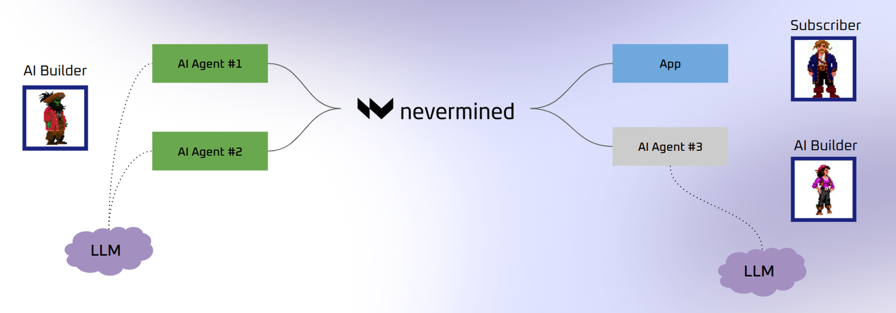

[](https://nevermined.io)

# Library for activating AI Agents Payments using Nevermined protocol

> Typescript SDK to interact with the Nevermined Payments Protocol
> [nevermined.io](https://nevermined.io)

## Motivation

The evolution of AI-native commerce is inevitable, but the infrastructure to support it is insufficient. Today, AI agents require seamless, automated payment systems for individual transactions. As the need grows, these agents will scale into swarms, with the ability to transact and operate autonomously.

Existing solutions are designed for their usage by humans using physical money. This doesn’t represent a new reality where AI Agents need to make and receive payments quickly and efficiently without the limitations of existing payment systems.

Nevermined provides a solution that seamlessly evolves from single-agent needs to complex AI economies, eliminating friction and supporting a fully autonomous, composable future for AI-driven commerce.

## What is Nevermined Payments Library?

Nevermined Payments Library is a Typescript SDK that allows AI Builders and Subscribers to make available AI Agents for being queried and used by other agents or humans. It is designed to be used in conjunction with the Nevermined protocol, which provides a decentralized infrastructure for managing AI agents and their interactions.

The Payments Library allows:

* Easy registration and discovery of AI agents, payment plans required to access them. All the agents registered in Nevermined expose their metadata in a generic way, and this metadata is searchable, allowing them to discover other agents fitting a specific purpose.
* Allows to define pricing options and how AI agents can be queried. This is done via payment plans (based on time or credits) and consumption costs (fixed per request or dynamic). All of this can be defined by the AI builder/agent during the registration process.
* It allows subscribers (human or other agents) to purchase credits that give access to AI agents services. Payments can be in crypto or in fiat via Stripe integration. The protocol registers on-chain the payment and the credits distribution settlement.
* Agents or users owning access credits can query other AI agents. Nevermined authorizes only the users with enough balance and keep track of their usage of credits.

[]

The library is designed to be used in browser environments or as part of AI Agents:

* When the library is used in a browser, it provides a simple way to connect to the Nevermined protocol and allow users to query AI Agents or publish their own.
* When the library is used as part of an AI Agent, it allows the agent to query other agents in a programatic way. Beyond that agents can use the library to expose their own services and make them available to other agents or humans.


## Quickstart

```
# yarn
yarn add @nevermined-io/payments

# npm

npm install @nevermined-io/payments
```

## Requirements

To use the Nevermined Payments Library, you need to get your Nevermined API key. You can get yours freely from the  [Nevermined App](https://nevermined.app).

### Initialize the Payments library in the Browser

This is a browser only method. Here we have an example using react.
For a full example please refer to [payments-nextjs-example](https://github.com/nevermined-io/tutorials/tree/main/payments-nextjs-example)

```typescript
import { useEffect } from "react";
import { Payments } from "@nevermined-io/payments";

export default function Home() {
  const payments = new Payments({
    returnUrl: "http://localhost:8080",
    environment: "staging",
  });

  const onLogin = () => {
    payments.connect();
  };

  useEffect(() => {
    payments.init();
  }, []);

  return (
    <main>
      <div>
        <button onClick={onLogin}>Login</button>
      </div>
    </main>
  );
}
```

The `init()` method should be called immediately after the app returns the user to `returnUrl`.

### Initialize the Payments library in an AI Agent

```typescript
import { Payments } from "@nevermined-io/payments";

const payments = Payments.getInstance({
  nvmApiKey,
  environment: 'testing' as EnvironmentName,
})
```

### Create a Payments Plan

Once the app is initialized we can create a payment plan:

```typescript
const priceConfig = getERC20PriceConfig(20n, builderAddress, ERC20_ADDRESS)
const creditsConfig = getFixedCreditsConfig(100n)
const { planId } = await paymentsBuilder.registerCreditsPlan(priceConfig, creditsConfig)
```

Or register a plan limited by time:

```typescript
const priceConfig = getERC20PriceConfig(50n, builderAddress, ERC20_ADDRESS)
const creditsConfig = getExpirableCreditsConfig(86400n) // 1 day
const { planId } = await paymentsBuilder.registerTimePlan(priceConfig, creditsConfig)
```

### Create an AI Agent/Service

```typescript
// Some metadata about the agent
const agentMetadata = {
  name: 'E2E Payments Agent',
  tags: ['test'],
}

// The API that the agent will expose
const agentApi = {
  endpoints: [
    { 'POST': `https://example.com/api/v1/agents/(.*)/tasks` },
    { 'GET': `https://example.com/api/v1/agents/(.*)/tasks/(.*)` }
]}

// This is the list of payment plans that the agent will accept
const paymentPlans = [ planId ]
const { did } = await paymentsBuilder.registerAgent(agentMetadata, agentApi, paymentPlans)

```

